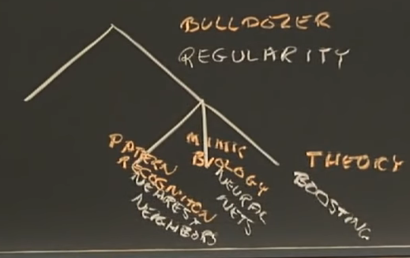
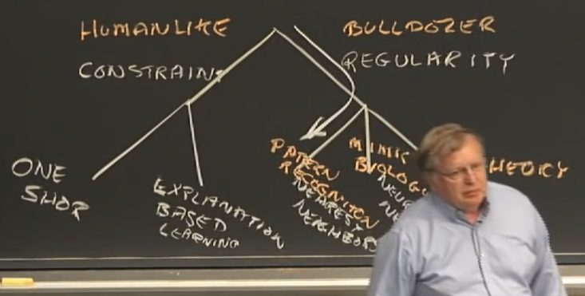

## Lecture 10 Learning, Nearest Neighbors (Week 16 May232021)

**Main Agenda**
- The Lay of the Learning Land
- Nearest Neighbors
    - covers
    - cells
    - information
    - arm control
- Problems

**Gold star ideas**
- ...

### Introduction to Learning

Today's materials are quite easy.

First lecture on learning, followed by discussion on sleep

There are **two kinds of learning:**
1. **Bulldozer Computing** --> learning based on observations of regularity. computers are particularly good at regularity
    - **Pattern Recognition** --> Nearest Neighbors --> have been around for a long time, it is the things taught in 18.01 (single variable calculus), and is extremely useful. It is the first thing to try when you have a learning problem, because it is the simplest thing (try simple things first so you can understand)
    - **Mimic biology** --> Neural Nets
    - **Gift of the theoreticians** --> Boosting
2. **Humanlike** --> learning ideas based on constraints
    - **learn something definite from each experience** --> one-shot learning
    - Explanation-based learning

AI has borrowed, stolen, improved, invented some stuff, that is why our discussion of learning will reach around all of these topics

## Pattern Recognition and Nearest Neighbors

Feature detector and comparator, compare with library, and outputs recognition

**Of course, there is noise, there is manufacturing variability, so the measured features won't be precisely categorized**

We have to figure out what those newly viewed objects are closest to in order to do an identification

We can just calculate the distance to those standard, platonic, ideal descriptions of things, and we find out which is nearest.

**But in general, it is easier to think about producing some boundaries between these various idealized places to make decision**

**Constructing perpendicular bisectors as boundaries**

