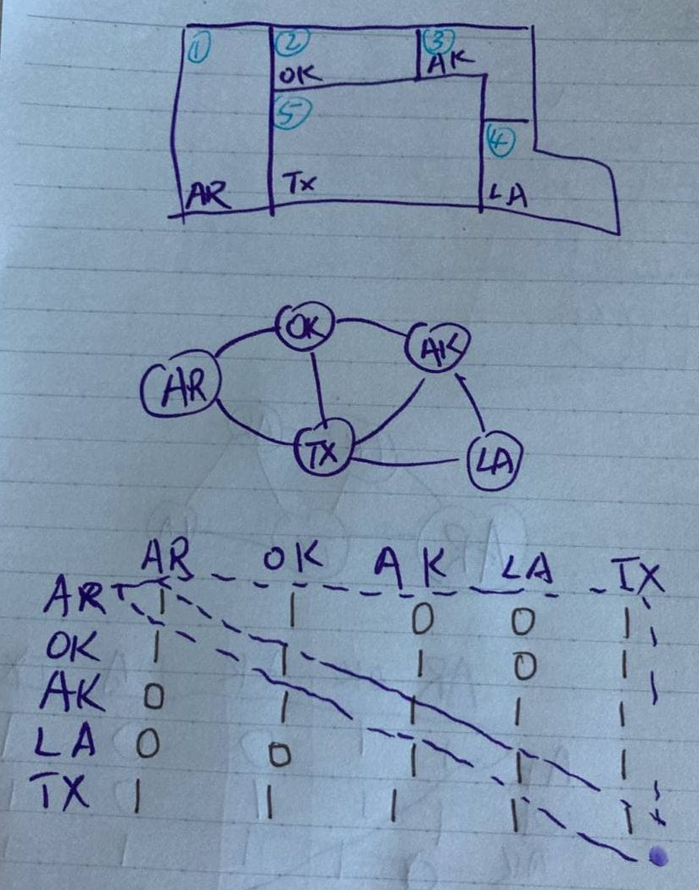
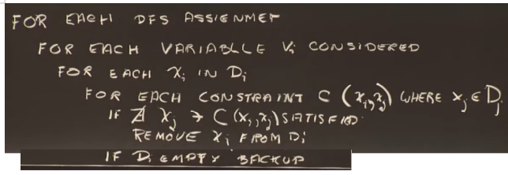
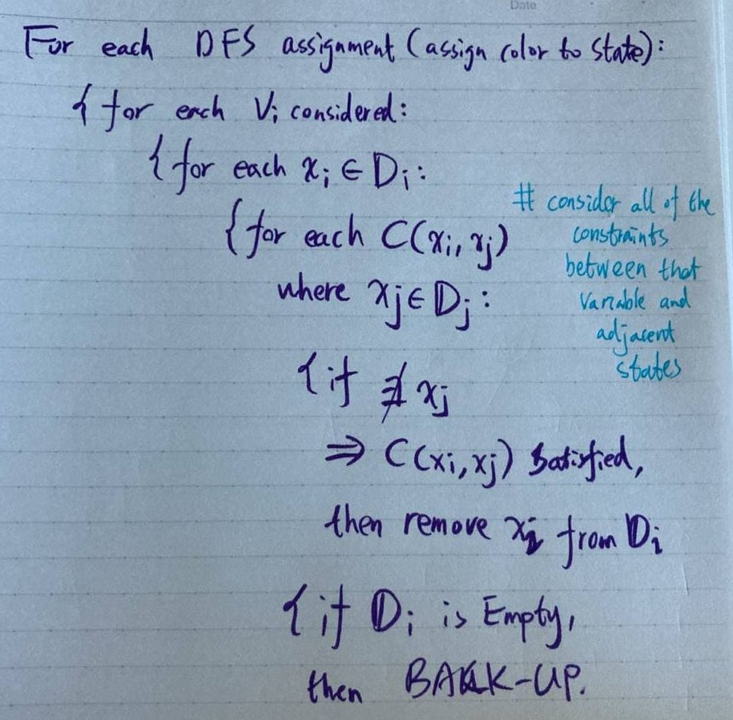

## Lecture 8 Constraint: Map Coloring and Flight Scheduling (Week 14 May092021)

**Main Agenda**
- the trouble with ??as
- domain reduction algorithm
- propagation options
- deering effects
- resource planning
- Over/Under

**Gold star ideas**
- marshal arts principle
- anytime algorithm

### Simplicia Map Coloring

There are 26 states, one for each letter in the alphabet

First do a depth-first-search for a suitable coloring of this map (going down the order a-b-c-d-e...)

**At each level, we are going to rotate the color choices so we don't over-use any one color**

The program demoed in lecture is roughly 30 frames a second, and it will take 5000 years to iterate through.

If you use as many states as there are in the Unites States, you get up to 10^17~18th years

Of course you could do some parallels into that, and it is not as bad as chess, where you need all the atoms in the universe and you still cannot do it.

But still, it is pretty horrendous.

### Problem with dfs

If you do a depth-first-search and you have a problem like Texas and Arizona, Oklahoma, Arkansas and Louisiana first, and then wait around to do Texas last, then you get yourself into a bind by your fourth choice, that you don't discover until your 48th choice --> you develop a horrendous impossible Search

**Constraint Propagation to the Rescue!**

Just like in the case of trihedral line-drawings, we will pile up all the possible things that the value can be -- Red, Green, Blue, Yellow, and we start up constraint propagation

So we say for the upper left hand corner state, is there any reason to believe that Red is impossible? We look at the neighbors and see **what kind of constraint flows in from the neighbors**. They do not have to be Red, so there is nothing that rules out Red in the upper left hand corner state (and nothing that rules out green, blue, yellow)

_We have elected to assign colors to these states in this order: AR -> OK -> AK -> LA -> Tx_

_And we are going to rotate our color choices, just so we don't overuse any one color_

_But we are going to also have a look at Texas as we go around, because Texas is bordering on the states that we are choosing colors for_

So the only possible colors that Texas could be are RGBY

When we run out of choices to color Texas, we **back up**, so that means that Yellow is ruled out for Louisiana, and Texas is assigne Yellow. **Then we select the next color in line for Louisiana, which happens to be red**. And now this is consistent with Yellow in Texas and Blue in Arkansas.

**We are using the martial arts principle again, because the whole problem is that local constraints, undiscovered local constraints are causing downstream problems** --> we are going to use the enemies' power against them

We will look at the local constraints as we go and make sure they are not going to get us downstream

### Language to Describe What is Going On

So it is clear what the choices are.

**Vocabulary**
- Variable `v`: something that can have an assignment
- Value `x`: something that can BE an assignment
- Domain `d`: a bag of values
- Constraint `c`: a limit on (pairs of variables, and pairs of variable values), but in general it can be limit on variable values `x`

The states = variables `v`

The colors = values `x`

Domain = Bags of colors = Remaining color possibilities that we can still use on a particular state

Constraint = Map coloring constraint that no states that share a boundary can have the same color (adjacent states cannot have same color)

### Reduce Intuition to a Procedure

**All we are doing is we are making these Depth-First Search assignments. Then in the neighborhood of those depth first assignments, we are looking around to see if the values that are possible include something.**

**And if they don't include anything, we know we made an irrevocable blunder and we have to back up**

### Consider

What to consider?
- Nothing: no checks at all
- Everything: _as soon as we color our first state, we check to make sure that all 47 other states can be colored_
- Assignment: at least check the _current_ assignment --> takes 17 billion years
  - because of the unfortunate choice of Texas as the last state to be considered
  - and the unfortunate coloring of the four surrounding states
  - and our unfortunate decision to rotate the color so as to avoid overdoing any one color
- Check Neighbors with Reduced Domains: check the neighbors of the assignments
  - Just like we did for Texas: _we checked Texas each time we made one of those four choices, because Texas is a neighbor of all of the choices of the states that we made
  - will go through a lot of effort: 9k dead ends and 54k constraints checked
  - but it did some good, it did not take a length of time longer than the remaining part of the universe to complete
- Propagate checking through variables with reduced domains: if we make a change to a neighbor, then we check its neighbors, too
  - zero dead ends, only 2k constraints checked
- Propagate checking through V with domain reduced to one value (**propagate through domains shrinking to one value**): we are not going to propagate through all of the variables which have their domains shrunk a little bit. We are only going to propgate through those that have greater shrinkage, all the way down to a single values
  - 2 dead ends, but only 980 constraints checked!
  - **winner!**

**Consider summary**:
1. you don't want to consider nothing, because then you are not honoring your constraints, at least check the assignments because otherwise you will construct a solution that violates a constraint.
2. don't consider everything, because that is excessive work
3. Checking the neighbors is a good idea
4. In practice, it is **better to do some propagation through the things that you have changed**
5. **How much propagation?** It does not seem to do much good to propagate through things that are just changed, **it seems to do good to propgate through the things that have changed AND BEEN REDUCED TO A SINAGLE VALUE**
6. **SO, as soon as you get a neighbor of some assignment you just made that has its domain reduced to a single value, then you check its neighbors, too!**
7. So you check the neighbors of the neighbors of the neighbors... **as long as you have found a domain being reduced, and not only being reduced but reduced to a single value**

### Discussion on Map constraints

We have highly constrained states that have a lot of bordering states around them, but we also states like Maine that only borders on one other state.

**dirty little secret: if we had arranged our states from most constrained to least constrained, ordinary depth-first search with NONE OF THE NEIGHBOR CHECKS will work JUST FINE!!** --> dead ends = 3, constraints checked = 0

**It is a little bit like games, do you use progressive deepening, or do you use alpha beta? And the answer is both. _You use everything you have got to deal with the problems_**

### Resource Planning Problems

Get by with **smallest number of airplanes** --> resource allocation problem

As you make your choices, you will rotate the aircraft

**Constraint = no single physical aircraft can fly two flights at the same time** --> no same time constraint

You can also have other constraints like "minimal ground time constraint"

**Constraint checks: assignments only --> situation that is guaranteed to lose at the bottom because of the choices made at the top**

**Constaint checks: neighbors only --> works**

### Make Map Coloring and Resource Allocation Easier

Use a whole lot of colors (it is the use of four colors that got us into trouble)

What is the maximum number of airplanes we are going to need? == number of flights

What is the minimum number of airplanes we need? == 1

**anytime algorithm --> you are not sure, but you know it is going to be some answer ready**

### Summary

1. always want to use most constraint first
2. you want to propgate through domains reduced to a single value
3. if you need to figure out the minimum number of resources needed is, do under/over business and quickly converge on a narrow range (when you over resource, it is fast to complete, and when you under resource, it is fast to terminate)
