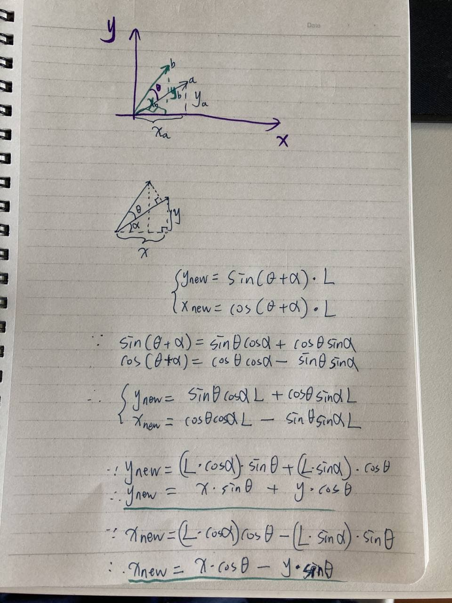

## Lecture 9 Constraint: Computer Vision OBject Recognition (Week 15 May162021)

**Main Agenda**
- Gospel According to Marr
- Ullman's Alignment Theory
- Ullman's Intermediate Features Theory
- Correlation
- still not solved, the attempts at solution have evolved very very slowly over the past 30 years (1980-2010)

**Gold star ideas**
- Rumpelstiltskin principle
- Goldilocks principle
- Power of Correlation

### David Marr, Primal Sketch, 2.5D Sketch

David Marr (1945-1980) was a British neuroscientist that integrated results from psychology, AI, and neurophysiology into new models of visual processing [[Marr's wiki]](https://en.wikipedia.org/wiki/David_Marr_(neuroscientist))

David Marr is such a powerful and central figure that almost anything he said was believed by a large collection of devotees.

Marr articulated a set of ideas about how computer vision would work that started off by suggesting that **with the input from the camera, you look for edges/edge fragments, and form this edge-based description of what is out there in the world, and Marr called it the PRIMAL SKETCH**

From the primal sketch, the **next step is to decorate the primal sketch with some surface normal vectors, showing where the faces on the object were oriented, and Marr called it the 2.5D sketch**

It is 2.5D because it is still 2D with camera-centric way of presenting information, but at the same time it attempts to describe the 3D arrangement of the surfaces

**The speculation was that you could not recognize the object in one step, so you needed several steps to get from the image to something you can recognize**

And the **third step was to convert the 2.5D sketch into generalized cylinders, and matched against a library of such descriptions, results in recognition**

Great theory:
1. start off by looking at edges
2. several steps of **transformations of representational apparatus**
3. produce something you can look up in a library of descriptions

Trouble is no one can make it work, too hard and too coarse to do it.

## Shimon Ullman, Alignment Theory

Shimon Ullman is one of Marr's students received his PhD in 1977, currently a professor at Weizmann Institute in Israel [[Ullman's wiki]](https://en.wikipedia.org/wiki/Shimon_Ullman)

The Alignment theory of recognition is based on a very strange and exotic idea.

If you have three pictures of a transparent object (so you see all the vertexes, all visible vertexes), you can reconstruct any view of that object **in orthographic projection**

**Therefore if you are close enough to the object and you switch to "perspective projection", it does not work**, but for the most part, you can neglect perspective after you get about 2.5x as far away as how big the object, and you can presume you have orthographic projection projection.

It is important that these pictures/views of the object **not be just rotations on one axis, because they would not form a basis set**

**There is one set of alpha, beta, gamma, and tau that works for everything, for all four points**

The relationship between the points on the unknown object and the points in this stored library of images are related linearly --> that is true because it is orthographic projection

4 equations and 4 unknowns, and we can predict where the corresponding point is going to be in the 4th image; and if it isn't, we are highly suspicious about whether this object is the kind of object we think it is.

## Demo of Matrix Transformations for Generalized Rotation in 2D

The z-axis is pointing toward you, and when the object rotate around the z-axis. Find out how the x-coordinate in the image of the points move as I do the rotation.

_Key to the 2D rotation matrix derivation: angle sum rule:_

After linear manipulation of x_a x_b and x_mu, we get linear relations for orthographic projection, which is when there is no perspective involved, just taking **the projection along the x-axis**

Trouble is the alignment theory does not work fine on natural objects, it works fine on things that are manufactured because they all have identical dimensions.

For our faces, it is also difficult to find the exact corresponding points, and if program uses non-corresponding points to make predictions, it would be way off.

This is still in the traidition of working from **local features in the objects towards recognition**, does not solve the whole recognition problem

## Shimon Ullman and Correlation

Shimon Ullman comes up with another theory that is **not based on edge fragments or the location of particular features, but rather on correlation**

Use correlation mask and run it all over the picture of the class and seeing where it maximizes out

No need to look for the whole face, but also cannot just look for eyes, because program can find eyeballs in very doorknob

We look for intermediate features, like 2 eyes + 1 nose, or 1 mouth + 1 nose

That is the **Goldilocks principle**, not too big, not too small

## Goldilocks Principle

> The Goldilocks principle is named by analogy to the children's story "The Three Bears", in which a young girl named Goldilocks tastes three different bowls of porridge and finds she prefers porridge that is neither too hot nor too cold, but has just the right temperature. The concept of "just the right amount" is easily understood and applied to a wide range of disciplines
> -- from wiki (https://en.wikipedia.org/wiki/Goldilocks_principle)

## Rumpelstiltskin Principle

Marr was a genius at naming things, even though many of his theories have faded, he is still known for these names like primal sketch and 2.5D sketch, **he is such an artist at naming the concepts**

## Face as Signal, Integral and Normalization

We are good at picking faces out of images.

Two eyes is an intermediate-size constraint, it is loose enough that it will match more than one person, but it is not so loose as bad as looking for only one eye

**But this correlation matching is recognizing faces straight on, but not from the side ==> it is possible that we have an ability to make those transformations from looking at side, and alignment theory has a role to play**

Another theory is that after I have seen you once I can watch you turn your head and keep recording what you look like at all possible angles (not is there enough capacity in our brain?)

Turning the face upside down would make it hard to do both correlation and alignment.

## Current Question in Computer Vision

People have worked for a long time on computer vision and recognition stuff, and have neglected the more serious questions: **how do you visually determine what is happening?**

If you could write a program that would reliably determine when these verbs (approach, dig, fall, give, hit, lift, fly, receive, bury, hand, kick, open, walk, bounce...) are happening in your field of view, Patrick will sign your PHD thesis right away.

Hypothesis: we are telling a story with our visual apparatus when we recognize actions in field of view.

Our power of storytelling even reaches down into our visual apparatus. The visual apparatus and storytelling apparatus work together to label and recognize actions.
